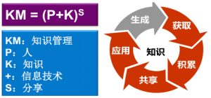
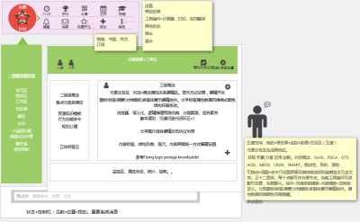
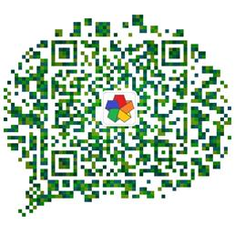

KMAgent-个人智能助理
==================

个人知识智能助理（KMAgent, Knowledge Management Agent）--专注智能知识管理GTD 多元融合创新 发扬传承智慧！

[KMAgent](http://kmagent.com) 以**个人知识管理 GTD**应用为主的工具效率软件。基于交互区+文档的协同学习工作空间，专注于语义计算、知识工程，致力于通过自然语言处理、机器学习、知识图谱等人工智能技术，简化知识增强认知、融合支持优秀方法论模板，辅助高效学习工作，扩展个人能力，类似钢铁侠的【贾维斯】。以开源项目的形式结合产学研，支持社群协同积累创新，节省时间精力，从知识中挖掘智慧。您的私人知识引擎、秘书、智友、智囊团。

请查看网站 [http://kmagent.com](http://kmagent.com) 获取相关安装指南及使用说明。

## 为什么Why?

> 特别重要的两个能力：1、制造工具；2、寻求合作。

**智能时代，信息爆炸，知识匮乏，辅助做减法！协同合作，降低信息熵，提高智商，极简智能知识管理！**

- **知识财富**，积累知识胜过积累金钱，知识是人类进步的阶梯。是个人及企业的核心竞争力！
- **化繁为简**，发现模式化繁为简，挖掘本质及关联，知其然知其所以然，促进融合创新。
- **人类智能**，挖掘隐性知识、理解人类多元智能，发掘利用大脑潜力，挑战认知极限。
- **知识传播**，静态文本书籍的缺陷、探索新的知识存储展示分享方式，建立高效沟通协同与积累分享的基础。
- **实现应对人工智能**，知识与智能相辅相成，知识管理作为核心环节，承上启下形成闭环，社群协同积累创新。
- **重新造轮子**，为自己开发一个工具，自然交互降低工具学习使用成本，支持学习工作生活。
- **作为事业**，值得奋斗十年的事业。  

Do something diferent, make a change!

## 【产品简介】产品原型正火速开发中！

> 是以文档+交互区为中心的功能集成，资源事务行为的协同智能管理GTD。首先用于协同建立核心概念理论体系，知识管理业务建模，积累分享资源知识技术，应用于KM、IT、AI、数学相关领域知识的学习整理。

功能及特性：

- 多媒体无限画板、实时协同文本导图编辑器，富文本和 Markdown 扩展编辑。
- 支持本体建模、阅读笔记、灵感便签、思维导图、各类模板。
- 划词翻译知识解释、搜索、百科字典。
- 知识可视化，多层次粒度维度去冗余，浓缩摘要、生成博客。
- 知识导入导出、Web 知识抽取集成。
- 资源管理、公共+个人+领域知识图谱。
- 收藏订阅评论分享、话题课程小组班级圈子。
- 项目事务的PDCA、GTD，日历日程安排提醒。
- 即时通信、实时协同、项目合作、积分系统。
- 个性化自学习聊天机器人、虚拟形象、语音识别生成、事务代理、主动推荐提醒引导辅助。 
- 自然语言交互、语义化、响应式生成式、文本化、可视化、极致沉浸体验。
- 高级功能：自定义配置、命令行、领域语言。

辅助您进行极简智能知识管理：知识可视化创作展示，简化结构化已有知识资源，建立知识体系。深入本质理解知识、整体高效合作学习。个人事务的管理、原则方法论习惯的养成。语义计算，辅助推理、仿真、预测、决策。聊天解闷启发。

很高兴您 [下载试用](http://kmagent.com) 并 [回馈使用情况](http://kmagent.com)。

随着开发进展，会及时列出最新特性、新功能及改进情况。查看 [v0.1 -> v1.0 升级信息](https://github.com/kmagent/blob/master/docs/guides/Upgrades.md)，获取更多产品升级信息 。

## 【参与贡献】

> 我们是一个协同学习型组织，以开源项目为中心，结合产学研，理论技术知识能力实践闭环正反馈迭代积累的过程，人与人与机器机器的合作学习！项目处于初期规划阶段，**欢迎各位有志之士的加入！**

基于共同信念、统一基础、协同机制，自由分工合作的工作组，可选择一个或多个模块参与合作学习及开发，根据 [规则](https://github.com/GYGit/KiMi/blob/master/0-team-社群/rules贡献积分规则.md) 记录贡献积分，按贡献分配奖励，未来若盈利可分红，涌现集体智慧！欢迎每个人贡献力量、收获积分朋友知识工具技术。

【值得加入】知识改变命运，创新改变世界！改变自己从心而为，不忘初心方得始终！

多种贡献方式

  - 可参与理论研究、业务建模、技术开发、项目管理、运营、投资、试用分享推广。
  - 提交或投票新功能特性需求[ProductPains](https://productpains.com/product/keystonejs)
  - 工具使用[情况反馈](http://kmagent.com)

欢迎提交[pull requests](https://github.com/kmagent/kmagent/pulls) 及 [issue](https://github.com/kmagent/kmagent/issues)。

若贡献源码请阅读遵循 [编程风格](https://github.com/keystonejs/keystone/wiki/Coding-Standards) 及 [贡献说明文档](https://github.com/kmagent/kmagent/blob/master/CONTRIBUTING.md)。

## 致谢

【源计划】KMAgent 当前是一个公开社群和免费软件，感谢所有促进其发展的 [贡献者](https://github.com/GYGit/KiMi/blob/master/0-team-社群/effort-point.md) 和  [深度用户](https://github.com/kmagent/ kmagent/fans.md)。【捐赠】如果您认同我们请支持我们快速持续发展。

## 主要模块

【核心重点】智能体语义元核心抽象、认知建模、知识图谱、智能知识管理GTD解决方案、产品设计开发，社群运营协同积累创新。（智能基础->智能核->智能块->智能体）群体智能->通用智能，模拟->超越。模块：km-thory km-engine km-onto km-agents km-sys km-ui、km-graph。

【领域及技术】数学算法、机器学习（tensorflow）、模式识别、自然语言处理（NLTK、hanlp）、图数据库（neo4j）、分布式存储（ceph）、语义网（OWL）、web知识发现（爬虫）、检索（lucene）推理推荐、知识工程（业务）、多agent集群智能（架构）、复杂系统、软件工程（项目开发管理）、安全网络通信加密权限认证（openSSL）、区块链、VR、领域语言代码生成（DSL）、认知心理、人机交互UI（vue.js、bootstrap）、数据可视化、知识共享协议产权、社群体验经济、网站（keystone）、桌面（webkit、electron）、移动（weex）、大数据（spark）、虚拟化云计算（Mesos、docker、Kubernetes）。

【工作分解】**关键在于**：统一认识、工具支持、有效积累可持续发展。

- 业务建模（智能知识管理GTD理论体系）：核心抽象模型，人性建模。
- 产品设计（个人智能助理）：产品规划、虚拟形象UI设计、竞品分析。**参考产品**：protege、vscode、quip、knowledgebuilder、metacademy、wiki、CSDN知识库、sketchboard、feedly、onenote画板、foxmail、京东阅读、qq音乐、NetLogo、flyinglogic、sourceinsight、幕布、Anki、wolframalpha。
- 技术架构（通用智能系统）：分布式计算存储多智能体协同系统：普适网格语义人类计算。全平台、微服务、核心算法、技术选型、测试部署。C++、Python、js、HTML。
- 商业计划（SaaS 软件即服务）：以软件产品为中心的增值服务、品牌运营推广营销。
- 项目管理（小代价达到目的）：敏捷迭代、过程改进、配置管理。
- 社群建设（利益共同体联盟）：文化理念集体智慧、扩大影响。
- 知识创作（知识管理等领域知识）：知识管理、数学及IT、人工智能相关知识创作分享。

待办：

- 完善文档，项目计划、社群共识、贡献指南。
- KM 业务建模、需求分析、技术选型 。
- 召集合伙人、社群团队建设、产品博客
- 分工架构设计、原型开发。

已完成前期准备：

1. 定位理念文化、基本原则战略方向
1. 市场分析、技术可行性、产品规划、商业模式
1. 项目简介、范围模块、工作分解

##  关于项目【源计划】

【源计划】专注智能知识管理，创建知识之源。研究知识及认知的特性，建立相关理论模型、最佳工程化实践，理论假设+社群协同+智能助理，从道术器多方面，提高智商、降低信息熵、集体智慧、智能工具，扩展增强人的能力！

- **使命**： 多元融合创新、发扬传承智慧，知识改变命运，创新改变世界！做面向未来可持续的伟大事业，成为伟大的组织！
- **理念**：以人为本、 大道至简、开放合作共赢创新、极简智能、多元融合集体智慧。
- **价值主张**：元按规则关联导致混沌展现模式涌现智能，知识能力一体+整体知识学习教育。以不变应万变，先抽象泛化统一再具体化形式化个性化，实用价值驱动、理论技术知识能力实践闭环正反馈迭代的过程，社群协作+智能工具，极简智能，扩展增强个人能力，节省时间精力，高效学习应用创新！实践检验真理，创新=资源整合重组利用。统一集成，整体大于部分之和。

Do have faith in what you're doing! Later beter than never!

## 了解更多

> 关注公众号或加入微信群以获取最新消息及文章、参与讨论、联系加入我们。

交流【qq群】: 13679059  
**Email**: i@kmagent.com

  

开发【GitHub】:  [KMAgent](https://github.com/kmagent)  
产品【博客】: ['http://kmagent.com'](http://kmagent.com)   

## 参考

1. 相关文档

  - [**项目简介**](https://github.com/GYGit/kmagent/blob/master/0README.md) | [**功能列表**](https://github.com/GYGit/KiMi/blob/master/0-team-社群/0tool功能列表.md)
  - [**积分规则**](https://github.com/GYGit/KiMi/blob/master/0-team-社群/0rules贡献积分规则.md) | [**社群共识**](https://github.com/GYGit/KiMi/blob/master/0-team-社群/0socialshare社群分享.md)
  - [**组织章程**](https://github.com/GYGit/KiMi/blob/master/0-team-社群/0partnership合伙协议章程.md)

1. 相关项目

1. 书籍推荐

《智能知识管理》《多语自然语言处理》《知识系统工程》《知识大融通》《人工智能》《认知心理学》《本体建模与Web知识发现》《基于语义的Web数据挖掘》《机器学习》《多米尼克记忆》《金字塔原理》《思维导图使用手册》《创业者手册》《思想本质》...

## 尊重保护知识产权

相关内容知识：CC-BY-SA 知识共享署名-相同方式共享 3.0 中国大陆[许可协议](http://creativecommons.org/licenses/by-sa/3.0/cn)

开源项目：许可协议 [Apache License 2.0](http://www.apache.org/licenses/LICENSE-2.0)

标识 Logo：
标记 mark: 

------------------------

> *君子生非异业也，善假于物也！*  
> **最深刻的思考，最精简的知识，最智能的工具，最高效的协同，传承智慧创新未来！**  
> *幸福在于知足常乐、适可而止、记得感恩、懂得珍惜。从心而为成为自己！*

